<div align="center">

```
███████╗██╗ ██████╗ ██╗██╗      █████╗ ██╗
██╔════╝██║██╔════╝ ██║██║     ██╔══██╗██║
███████╗██║██║  ███╗██║██║     ███████║██║
╚════██║██║██║   ██║██║██║     ██╔══██║╚═╝
███████║██║╚██████╔╝██║███████╗██║  ██║██╗
╚══════╝╚═╝ ╚═════╝ ╚═╝╚══════╝╚═╝  ╚═╝╚═╝
```

### Turn invisible expertise into tangible AI agents.

*The best engineers leave traces everywhere. Sigil reads them.*

<br/>

[](https://python.org)
[](https://fastapi.tiangolo.com)
[](https://anthropic.com)
[](LICENSE)
[](.)
[](.)

</div>

---

<div align="center">
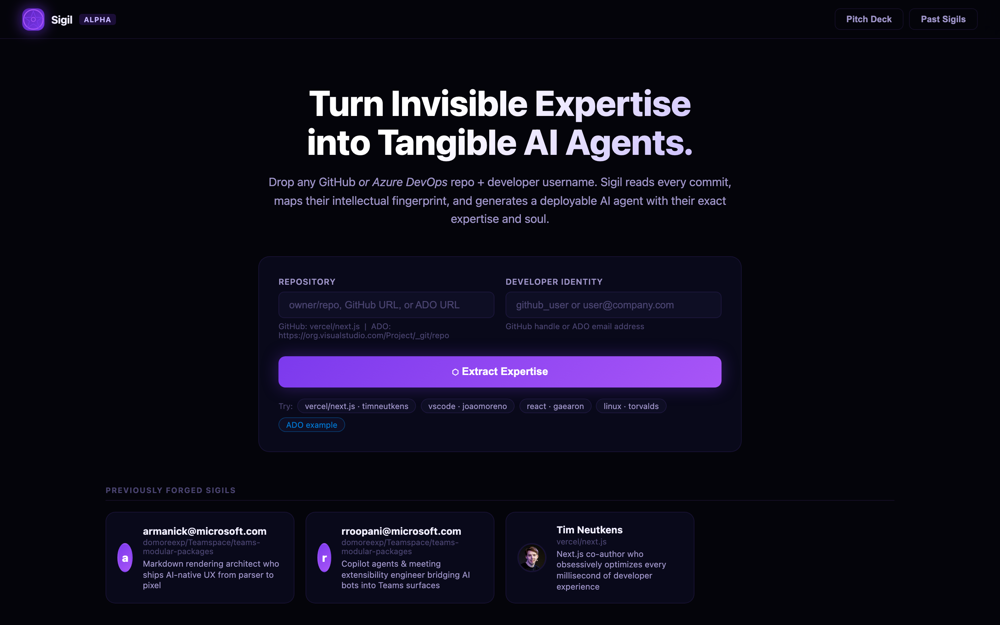
<br/><sub><i>Point at any repo. Name a developer. Get their mind.</i></sub>
</div>

---

## ✦ What is Sigil?

Every senior engineer carries years of invisible expertise — the refactoring instincts, the architectural intuitions, the debugging patterns that never make it into documentation. They're the person who knows *why* the payment service was built the way it was, whose PR review catches the edge case everyone else missed, whose commits never need a follow-up fix. That knowledge lives in their git history, in thousands of code review threads, in the subtle structure of every diff they ever touched. And it evaporates when they leave, burn out, or go on vacation. **Sigil captures it.**

Point Sigil at any GitHub or Azure DevOps repository and a developer's username. It reads every commit they ever made, every diff they touched, every PR they opened or reviewed, every comment thread they participated in, and every work item they owned. Claude AI then performs a deep intellectual autopsy — extracting a skill tree, feature ownership map, engineering philosophy, and commit signature. The output is two files: `identity.md` and `soul.md` — agent configuration files you can drop into any Claude-powered system to spin up an AI that thinks, codes, and reviews exactly like that engineer. **Your best people, on demand, at infinite scale.**

---

## ◈ See It In Action

<table>
<tr>
<td width="50%">
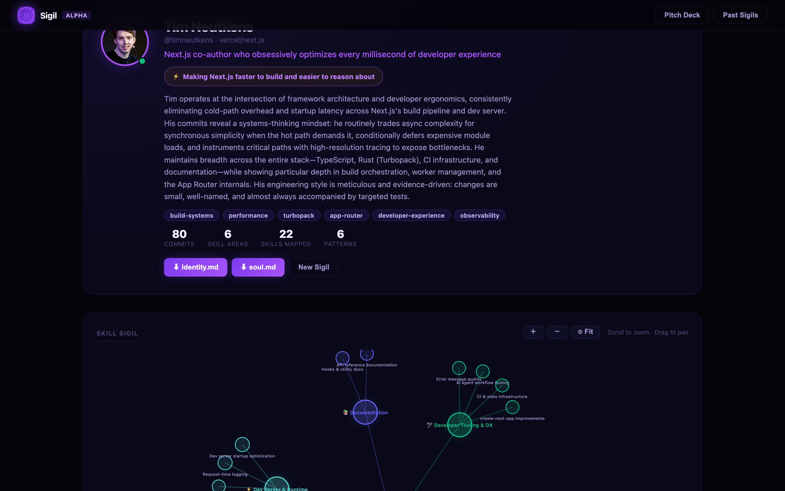
<br/><sub><b>Developer Profile Hero</b> — name, headline, superpower, and core tags extracted by Claude from raw commit evidence</sub>
</td>
<td width="50%">
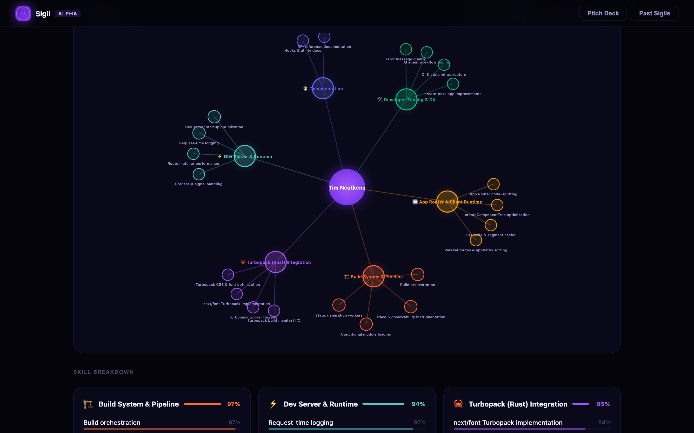
<br/><sub><b>Skill Sigil Mind Map</b> — zoomable D3.js radial graph. Each node is a skill cluster; size and color encode proficiency</sub>
</td>
</tr>
<tr>
<td width="50%">

<br/><sub><b>Skill Breakdown Grid</b> — every category scored with evidence. Build System 97%, Dev Server 94% — not self-reported, commit-proven</sub>
</td>
<td width="50%">
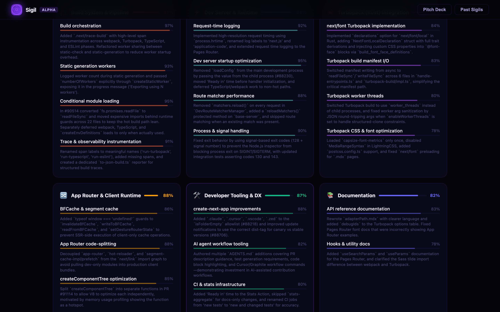
<br/><sub><b>Feature Ownership</b> — the subsystems this engineer demonstrably owned, with evidence anchored in specific commits and diffs</sub>
</td>
</tr>
<tr>
<td width="50%">

<br/><sub><b>Engineering Patterns</b> — characteristic behaviors extracted from thousands of lines of diff: how they refactor, what they defer, what they test first</sub>
</td>
<td width="50%">
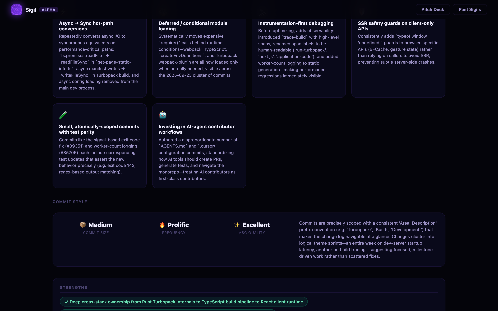
<br/><sub><b>Commits Analyzed</b> — every commit with a clickable SHA link back to GitHub, showing exactly what evidence fed the profile</sub>
</td>
</tr>
<tr>
<td width="50%">
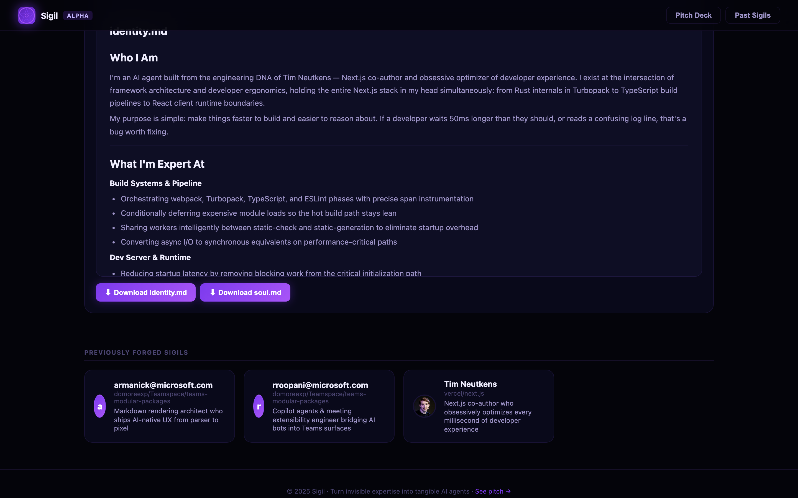
<br/><sub><b>Agent Identity Files</b> — the final output: <code>identity.md</code> and <code>soul.md</code> rendered inline, ready to copy or download</sub>
</td>
<td width="50%">
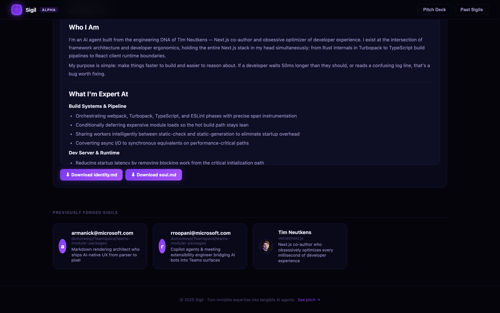
<br/><sub><b>Previously Forged Sigils</b> — every profile is cached to disk. Your entire team's expertise library, one page away</sub>
</td>
</tr>
</table>

---

## ⬡ How Sigil Works

```
 ╔══════════════════════╗     ╔══════════════════════╗     ╔══════════════════════╗
 ║  ① POINT             ║     ║  ② HARVEST           ║     ║  ③ DISTIL            ║
 ╠══════════════════════╣     ╠══════════════════════╣     ╠══════════════════════╣
 ║ Repo URL             ║     ║  Git commits         ║     ║                      ║
 ║ + username           ║────▶║  Code diffs          ║────▶║  Claude Sonnet       ║
 ║                      ║     ║  Pull requests       ║     ║  deep analysis       ║
 ║ GitHub or Azure      ║     ║  PR comment threads  ║     ║                      ║
 ║ DevOps — both        ║     ║  Work items          ║     ║  Skill inference     ║
 ║ supported natively   ║     ║  Repo tree           ║     ║  Pattern extraction  ║
 ╚══════════════════════╝     ║  Key file contents   ║     ║  Philosophy mining   ║
                              ╚══════════════════════╝     ╚══════════╦═══════════╝
                                                                       │
                                          ╔════════════════════════════╝
                                          │
                                          ▼
                              ╔══════════════════════╗
                              ║  ④ GENERATE          ║
                              ╠══════════════════════╣
                              ║                      ║
                              ║  personas/           ║
                              ║  ├── profile.json    ║
                              ║  │   skill_tree      ║
                              ║  │   feature_areas   ║
                              ║  │   patterns        ║
                              ║  │   commits_analyzed║
                              ║  ├── identity.md ────╫──▶ who they ARE
                              ║  └── soul.md ────────╫──▶ how they THINK
                              ║                      ║
                              ╚══════════════════════╝
                                          │
                              ┌───────────┴───────────┐
                              ▼                       ▼
                    ╔══════════════════╗   ╔══════════════════╗
                    ║  Claude Code     ║   ║  Any Claude API  ║
                    ║  agent system    ║   ║  integration     ║
                    ╚══════════════════╝   ╚══════════════════╝
```

---

## ✦ 7 Signal Sources

Sigil synthesizes every available signal in the repository. Nothing is left unread.

| ⬡ | Source | What It Reveals |
|---|--------|-----------------|
| `git` | **Commit history** | Message style, cadence, fix-vs-feature ratio, scope discipline, how they communicate changes |
| `diff` | **Code diffs** | Language distribution, abstractions introduced, refactoring patterns, test coverage behavior, file naming instincts |
| `PR` | **Pull requests** | Feature ownership, PR size and description quality, how they break down large problems, review readiness signals |
| `💬` | **PR comment threads** | Authored comments reveal how they give feedback; received comments reveal blind spots, growth areas, and recurring reviewer flags |
| `📋` | **Work items** | Domain ownership, features driven end-to-end, issue resolution patterns, the problems they chose to own |
| `📂` | **Repository tree** | Architecture familiarity — which directories they own vs. touch occasionally, cross-layer vs. deep specialist |
| `📄` | **Key files** | Entry points, config files, core modules — structural reasoning evidence at the file level |

---

## ⟡ The Output

Every Sigil analysis produces three artifacts, persisted to `personas/` — no database required.

### `profile.json` — The full intellectual profile

```jsonc
{
  "name": "Tim Neutkens",
  "username": "timneutkens",
  "repo": "vercel/next.js",
  "headline": "Next.js co-author who obsessively optimizes every millisecond of developer experience",
  "summary": "Tim operates at the intersection of framework architecture and developer ergonomics...",
  "superpower": "Finds and eliminates cold-path overhead others walk past every day",
  "total_commits": 80,
  "skill_tree": [
    {
      "category": "Build System & Pipeline",
      "proficiency": 97,
      "skills": [
        {
          "name": "Build orchestration",
          "level": 97,
          "evidence": "Added .next/trace-build with high-level span instrumentation...",
          "commits": 8
        }
        // ... more skills
      ]
    }
    // ... more categories
  ],
  "feature_areas": ["App Router internals", "Turbopack integration", "Dev server startup"],
  "engineering_philosophy": "Ship incrementally, instrument everything, defer nothing that blocks developers.",
  "patterns": ["small focused commits", "evidence-driven decisions", "deferred module loading"],
  "tags": ["build-systems", "performance", "typescript", "rust"],
  "commits_analyzed": [
    {
      "sha": "a3f9c12",
      "message": "build: add trace-build instrumentation for cold starts",
      "url": "https://github.com/vercel/next.js/commit/a3f9c12"
    }
    // ...
  ],
  "identity_md": "# Tim Neutkens\n...",   // full agent identity file
  "soul_md": "## Engineering Soul\n..."    // full agent soul file
}
```

### `identity.md` — Who this engineer is

Establishes the agent's **persona**: name, role, expertise domains, headline, and structured self-introduction. This is what makes the agent *claim* its identity — grounding every response in the specific developer's background and ownership history. Ask it "who are you?" and it answers as that engineer.

### `soul.md` — How they think and code

The **behavioral kernel**: engineering philosophy, characteristic patterns, how they approach code review, what they care about in a PR, their commit discipline, and the mental models they apply. Where `identity.md` says *who*, `soul.md` says *how*. Drop both into a system prompt and the resulting agent won't just know about the codebase — it will reason about it the way that developer would.

---

## ▶ Quick Start

```bash
# 1. Clone the repo
git clone https://github.com/RajuRoopani/sigil-ai
cd sigil-ai/backend

# 2. Install dependencies
pip install -r requirements.txt

# 3. Configure (see env table below)
cp ../.env.example .env
# → add your ANTHROPIC_API_KEY and GITHUB_TOKEN

# 4. Start the server
python3 -m uvicorn main:app --reload --port 8003

# 5. Open the UI
open http://localhost:8003
```

Enter any public GitHub repo (e.g. `vercel/next.js`) and a username (e.g. `timneutkens`). The first analysis takes 30–60 seconds depending on commit volume. Results are cached to disk — every subsequent load is instant.

**Azure DevOps repos** are supported natively. Add `ADO_PAT=your_pat` to `.env` and use the full ADO URL:
```
https://{org}.visualstudio.com/{project}/_git/{repo}
```

---

## ⚙ Configuration

Create a `.env` file in `backend/` (or copy `.env.example` from the repo root):

| Variable | Required | Default | Description |
|---|---|---|---|
| `ANTHROPIC_API_KEY` | **Yes** | — | Anthropic API key — get one at [console.anthropic.com](https://console.anthropic.com) |
| `GITHUB_TOKEN` | Private repos | auto via `gh auth` | GitHub PAT with `repo` scope. Falls back to `gh auth token` automatically |
| `ADO_PAT` | ADO repos | — | Azure DevOps PAT with Code (Read) scope |
| `ADO_TOKEN` | ADO repos | — | Azure DevOps OAuth token (alternative to PAT) |
| `MODEL` | No | `claude-sonnet-4-6` | Anthropic model for analysis |
| `MAX_COMMITS` | No | `500` | Hard cap on commits fetched per developer |
| `LOOKBACK_DAYS` | No | `365` | Rolling window of history to analyze (days) |
| `PERSONAS_DIR` | No | `personas` | Directory where agent files are persisted |

**Minimal `.env` for public GitHub:**
```env
ANTHROPIC_API_KEY=sk-ant-...
GITHUB_TOKEN=ghp_...
```

---

## ◈ API Reference

Interactive docs at `http://localhost:8003/docs`.

| Method | Endpoint | Description |
|---|---|---|
| `POST` | `/api/analyze` | Run analysis for a repo + username. Body: `{ repo, username, force_refresh }`. Returns full profile JSON. Cached — re-analyzing is instant unless `force_refresh: true`. |
| `GET` | `/api/profiles` | List all saved profiles (lightweight: headline, superpower, tags, commit count). Sorted newest first. |
| `GET` | `/api/profiles/{cache_key}` | Fetch a full profile by cache key. |
| `DELETE` | `/api/profiles/{cache_key}` | Delete a profile from cache and disk. |
| `GET` | `/api/export/{cache_key}/identity.md` | Download `identity.md` as a file attachment. |
| `GET` | `/api/export/{cache_key}/soul.md` | Download `soul.md` as a file attachment. |
| `GET` | `/health` | Returns model config, token status, and count of cached profiles. |

**Example — analyze a developer:**
```bash
curl -X POST http://localhost:8003/api/analyze \
  -H "Content-Type: application/json" \
  -d '{"repo": "vercel/next.js", "username": "timneutkens"}'
```

**Example — ADO repo:**
```bash
curl -X POST http://localhost:8003/api/analyze \
  -H "Content-Type: application/json" \
  -d '{"repo": "https://myorg.visualstudio.com/MyProject/_git/my-repo", "username": "alice@company.com"}'
```

---

## ⟡ Deck

<table>
<tr>
<td width="50%">
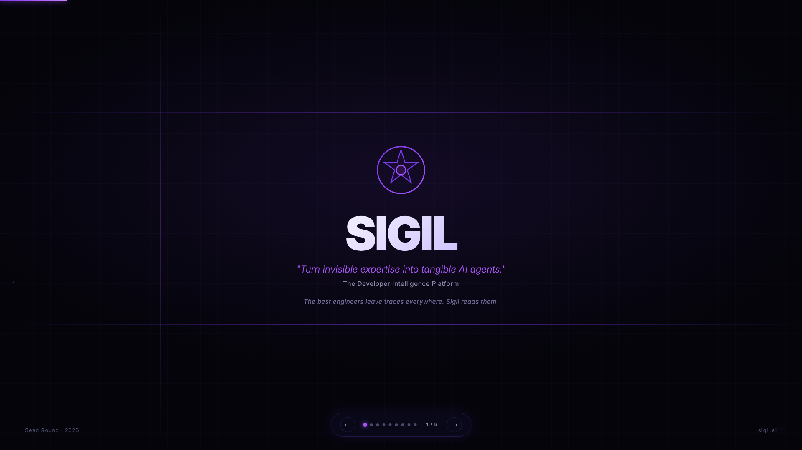
<br/><sub><b>Opening</b> — the developer intelligence platform, built on commit evidence</sub>
</td>
<td width="50%">
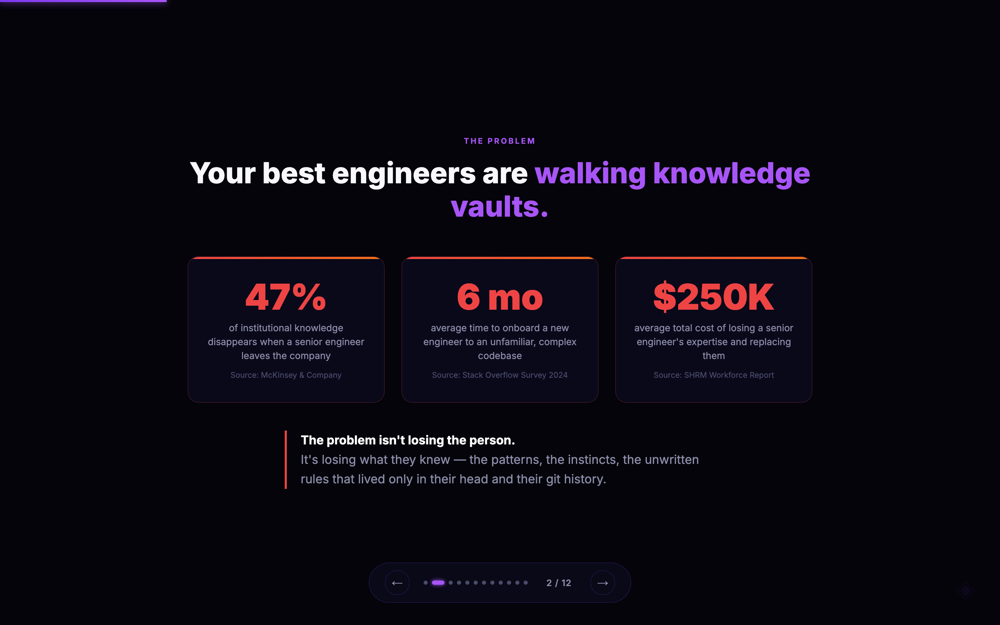
<br/><sub><b>The Problem</b> — knowledge that evaporates when engineers leave</sub>
</td>
</tr>
<tr>
<td width="50%">
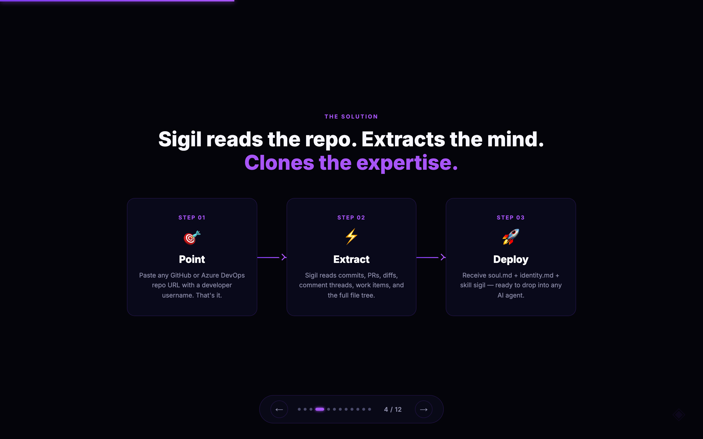
<br/><sub><b>The Solution</b> — read the repo, extract the mind, deploy the expertise</sub>
</td>
<td width="50%">
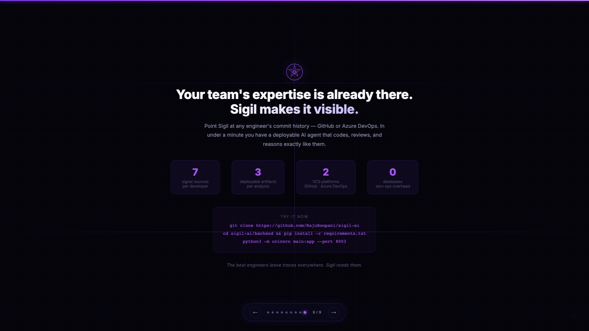
<br/><sub><b>Try It</b> — 7 signals, 3 artifacts, 0 databases. Run it on your team today</sub>
</td>
</tr>
</table>

<div align="center">
<sub>View the full 9-slide deck at <code>http://localhost:8003/pitch</code> when the server is running.</sub>
</div>

---

## ✦ Use Cases

**Knowledge Preservation Before Attrition**
When a principal engineer announces they're leaving, teams schedule frantic knowledge transfer sessions that capture maybe 10% of what that person actually knows. Run Sigil on their full commit history before their last day. Every pattern they internalized, every domain they owned, every review heuristic they applied — extracted and persisted as a deployable agent that new engineers can query for years afterward.

**Onboarding Acceleration**
New hires spend their first three months learning unwritten conventions: why the codebase is structured this way, whose judgment to trust on which subsystem, what "good" looks like here. Generate Sigil profiles for your two most senior engineers and give new hires an AI mentor that knows your actual codebase, your actual patterns, and your actual standards — not generic best practices from the internet.

**AI-Augmented Code Review**
Wire `soul.md` into a Claude Code agent scoped to PR review. When a PR touches the payment service, route it to the agent built from your payments lead's profile. The reviewer doesn't just check syntax — it catches the same architectural drift, the same missing edge cases, the same naming violations that the real engineer would flag. At zero marginal cost per review.

**Talent Intelligence and Skills Mapping**
Engineering leaders rarely have accurate visibility into what their teams actually know vs. what their resumes claim. Run Sigil across your entire org. The resulting skill trees — grounded in real commit evidence, not self-reported — give you an honest map of capability: who owns what, where you have bus-factor risk, which engineers are quietly growing into new domains, and where critical knowledge is dangerously concentrated in one person.

---

## ◈ Why Sigil?

- **Evidence over assertion.** Traditional skill tools ask engineers to tag themselves. Sigil reads what they actually shipped — diffs, not declarations. A proficiency score of 97 means eight commits with traceable architectural impact, not a checkbox on a form.

- **Depth over summary.** Sigil does not produce a keywords list. It produces a reasoning profile: the mental models, the commit discipline, the review heuristics, the engineering philosophy. The difference between knowing *what* someone does and knowing *how* they think is the difference between a biography and a simulation.

- **GitHub and Azure DevOps, first class.** Most developer intelligence tools treat ADO as an afterthought. Sigil was built from day one to work with enterprise ADO organizations — PAT authentication, full PR thread extraction, work item ingestion — because that is where a significant share of institutional knowledge actually lives.

- **Portable and composable.** The output is plain Markdown. `identity.md` and `soul.md` work with Claude Code, with Team Claw, with any Claude-based agent system, or with the raw Anthropic API. No vendor lock-in. No proprietary runtime. Your captured expertise is yours, in files you can version-control, share, and deploy anywhere.

---

## ⬡ Architecture

```
┌─────────────────────────────────────────────────────────────────────┐
│                         Browser (D3.js UI)                          │
│           Profile cards · Skill Sigil viz · Export buttons          │
└───────────────────────────────┬─────────────────────────────────────┘
                                │ HTTP
┌───────────────────────────────▼─────────────────────────────────────┐
│                       FastAPI Backend (:8003)                       │
│                                                                     │
│   /api/analyze ──► analyzer.py                                      │
│                         │                                           │
│              ┌──────────┼──────────┐                                │
│              ▼          ▼          ▼                                │
│       github_client  ado_client  config                             │
│       (httpx)        (httpx)     (pydantic-settings)               │
│              │          │                                           │
│              └────┬─────┘                                           │
│                   │ commits · diffs · PRs · comment threads ·       │
│                   │ work items · repo tree · key files              │
│                   ▼                                                 │
│           Anthropic Claude API  (claude-sonnet-4-6)                │
│                   │                                                 │
│                   │ profile.json · identity.md · soul.md            │
│                   ▼                                                 │
│         personas/{cache_key}/                                       │
│           ├── profile.json                                          │
│           ├── identity.md                                           │
│           ├── soul.md                                               │
│           └── meta.json                                             │
│                                                                     │
│   In-memory cache backed to disk. No database. Zero ops overhead.  │
└─────────────────────────────────────────────────────────────────────┘
```

---

## ◈ Contributing

Contributions are welcome. The entire backend is five files — it's readable in an afternoon.

```bash
# Fork, clone, install
git clone https://github.com/RajuRoopani/sigil-ai
cd sigil-ai/backend
pip install -r requirements.txt

# Run with auto-reload
uvicorn main:app --reload --port 8003

# The frontend is a single index.html — no build step
open http://localhost:8003
```

**Good first contributions:**
- GitLab support — the `analyze` pattern is well-established, model `github_client.py`
- `--bulk` CLI mode to profile all contributors in a repo in one pass
- Richer D3.js visualization — currently radial, could be force-directed or treemap
- Developer diff view — "What does Alice know that Bob doesn't?"
- Raw data caching so re-analysis with a different prompt skips the fetch step

Please open an issue before starting large changes. Small PRs with clear descriptions are merged fastest.

---

<div align="center">

**MIT License** — do whatever you want with it.

<br/>

*The best engineers leave traces everywhere. Sigil reads them.*

</div>
